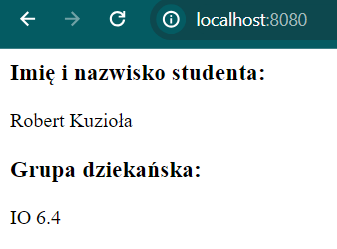
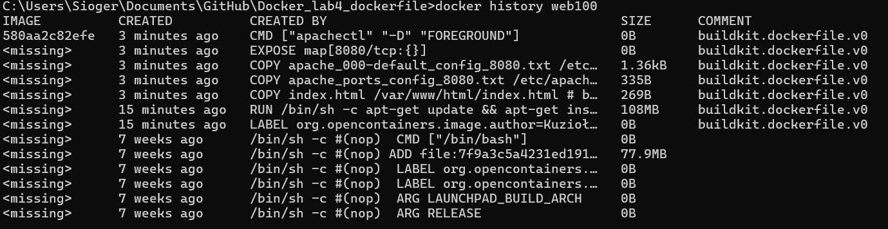

# Docker_lab4_dockerfile
 
Example usage of Dockerfile in configuration of Apache server on ubuntu with Apache running on custom port and with custom welcome page.

## Table of Contents

- [Requirements](#requirements)
- [Image Building](#image-building)
- [Container Setup and Running](#container-setup-and-running)
- [Image Layers](#image-layers)

## Requirements

For Linux and Windows systems Docker or Docker Desktop installed and running.

For Windows systems WSL installed.

## Image Building

Example for Windows:

Download files and open console. Change directory to the location of the downloaded files.

```cmd
cd C:\location\of\downloaded\files\
```

If changing Apache welcome page content, edit index.html file.

If changing current port Apache working on, edit apache_000-default_config_8080.txt and apache_ports_config_8080.txt files. For now port 8080 is set instead of 80. If setting up different port, change port 8080 to desired port.

Then run command to build new image with Dockerfile named web100:

```cmd
docker build -t web100 .
```

## Container Setup and Running

To create a container with the web100 image, specify the modes it will run in (-d in this case), ports (-p portOnYourHostMachine:PortOnApacheServer(8080 default for this image)), the name of the container (--name web100container in this case) and any additional options that will be needed. Example command below.

```cmd
docker run -d -p 8080:8080 --name web100container web100
```

After that, it is possible to access the Apache server working on the running container through port 8080 in this case. Just type localhost:8080 in the browser search bar.



If stopping a running container:

```cmd
docker stop web100container
```

If starting a container that is not running but was previously created:

```cmd
docker start web100container
```

## Image Layers

To specify what actions are responsible for creation of certain layers, execute another command:

```cmd
docker history web100
```

and look for lines where size in SIZE column is larger than 0B because only layers larger than 0B are considered as layers.

Result of previous command:



Looking at layers with a size larger than 0B, examine the CREATED BY column. There is information about what commands are responsible for certain layers.
